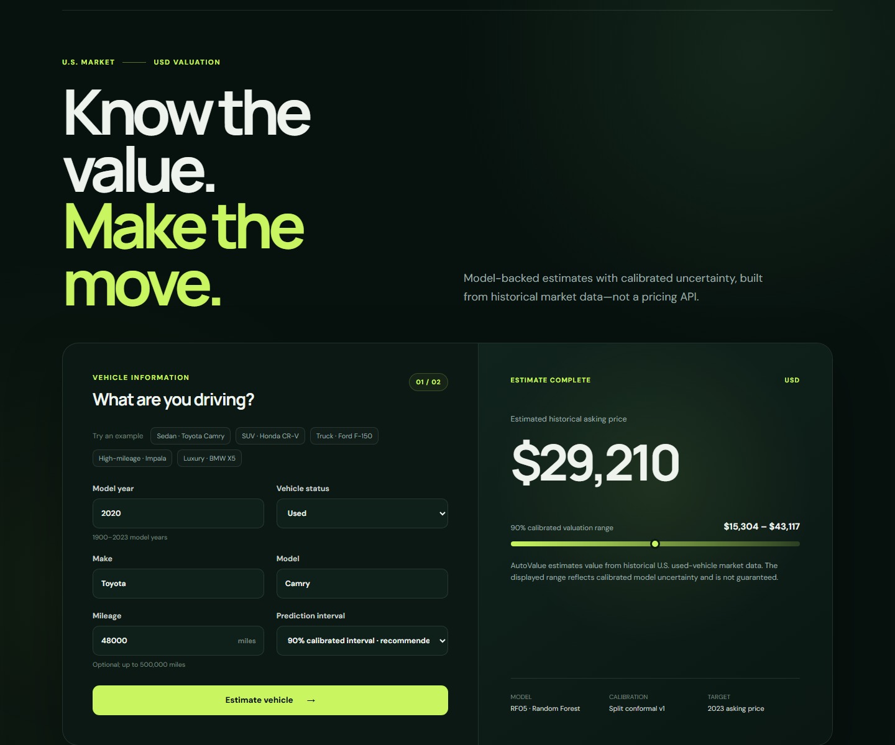
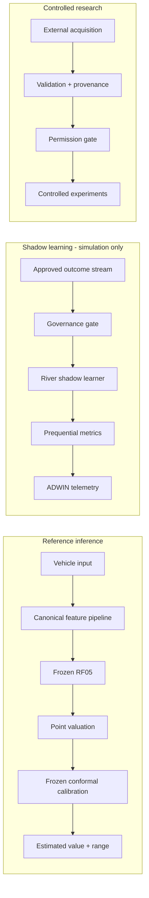

# AutoValue AI

**An end-to-end used-vehicle valuation ML engineering system.** AutoValue AI
combines leakage-safe batch modeling, calibrated uncertainty, governed
multi-source research, a River shadow-learning architecture, concept-drift
telemetry, and a production-style FastAPI/React product experience. It uses real
machine learning and no paid pricing API.

The active scope is the United States and USD. The frozen RF05 reference model
estimates historical 2023 advertised asking price—not a live quote, final sale
price, appraisal, or official Kelley Blue Book/AutoTrader valuation.

> **Current status:** the ML experimentation lifecycle is closed. The final
> holdout was opened once and is permanently evaluation-only. Productization is
> implemented around a checksum-verified, fail-closed serving boundary. A
> deployment-only process has deterministically reconstructed the already-frozen
> RF05 estimator from the exact 98,552 development rows, reproduced its five-fold
> evidence, and created an authenticated private local bundle. The binary remains
> excluded from Git and public redistribution; a clone without it truthfully
> reports `artifact required` and never substitutes a placeholder.

## Final evidence at a glance

| Evidence | Result |
|---|---:|
| Frozen model | RF05 Random Forest |
| Development observations | 98,552 |
| Separate calibration observations | 10,958 |
| One-time final holdout | 27,589 |
| Final MAE | $10,575.36 USD |
| Final RMSE | $34,118.14 USD |
| Final R² | 0.4176 |
| Median absolute error | $6,678.93 USD |
| Classification | Passed with material limitations |

| Prediction interval | Nominal | Final empirical | Mean displayed width |
|---|---:|---:|---:|
| 80% | 80% | 76.32% | $25,885.04 |
| **Default 90%** | **90%** | **89.10%** | **$38,434.98** |
| 95% | 95% | 95.64% | $64,028.15 |

The 90% interval is the default because it provides the strongest practical
tradeoff in the frozen evidence. These are calibrated prediction intervals, not
guaranteed ranges. Extreme asking-price outliers materially affect RMSE, and
performance varies by manufacturer and vehicle segment.

Material limitations remain visible: high-value vehicles have larger errors;
Mercedes and Porsche are weak supported manufacturer slices; intervals can be
broad; the asking-price data describes a historical 2023 market rather than the
live market; and River uses synthetic shadow scenarios with no verified live
outcome stream. This is a portfolio/research system, not an appraisal or offer.

## Product preview



The screenshot uses a project-owned example vehicle and the authentic private
RF05 serving path. No third-party source row or hand-authored valuation is shown.

## Product goal

The long-term goal is consumer market valuation. The 2023 listing source is the
closer product fit, but it contains advertised asking prices rather than final
transactions and is not a live market feed. Its model will therefore be labeled
as a historical U.S. asking-price estimate. The 2014-2015 auction source will be
trained and evaluated as a separate wholesale benchmark; its target will never
be presented as retail value.

A user enters only the inputs supported by the frozen retail feature contract:
model year, make, exact model, vehicle status, and optional mileage. The product
returns:

- an estimated historical U.S. advertised asking price;
- a practical prediction interval;
- transparent model and evaluation information; and
- recent predictions scoped to the current anonymous browser.

The current artifacts do not contain a defensible global importance report or
per-prediction explanation. The UI shows the active feature contract instead of
fabricating rankings. Engine, drivetrain, condition, accident history, owner
count, and vehicle type remain absent because RF05 was not trained on them.

## Architecture



The paths cannot silently cross governance boundaries. Training and tuning run
offline. The API loads a local estimator only after its SHA-256, RF05 identity,
pipeline structure, fitted state, and exact hyperparameters pass validation; it
then binds the estimator to the immutable calibration artifact. Missing or
mismatched artifacts return a sanitized `503`, never a demo estimate. See
[the architecture document](docs/architecture.md) for component boundaries and
[the deployment design](docs/deployment.md) for the zero-cost hosting plan.
The isolated [River shadow-learning design](docs/river-shadow-learning.md) is
experimental simulator plumbing and cannot affect this application path.

## Repository layout

```text
frontend/   React and Vite product interface
backend/    FastAPI HTTP service and application configuration
ml/         Cleaning, feature, training, evaluation, and inference code
data/       Dataset policy, manifests, and ignored local data directories
models/     Model artifact policy and metadata
tests/      Cross-component and integration test guidance
docs/       Architecture, data, ML workflow, decisions, and roadmap
```

## Public data governance

Real dataset files and row-level derivatives are local-only. The repository
publishes code, source decisions, checksums, attributions, synthetic fixtures,
and aggregate reports. Batch permission and River permission are independent;
all historical sources currently remain blocked from online updates. See the
[source register](DATA_SOURCES.md) and [dataset attributions](docs/data-attribution.md)
before downloading, processing, training on, or publishing anything derived
from a source.

## Run the portfolio application

Prerequisites: Python 3.11+ and Node.js 22+.

### Backend

```powershell
python -m venv .venv
.\.venv\Scripts\Activate.ps1
python -m pip install -r requirements-dev.txt
Copy-Item backend/.env.example backend/.env
$env:PYTHONPATH = "backend/src;ml/src"
python -m uvicorn autovalue_api.main:app --reload
```

Liveness is available at `http://localhost:8000/health/live`, model readiness at
`http://localhost:8000/api/v1/model`, and FastAPI documentation at
`http://localhost:8000/docs`.

### Frontend

In a second terminal:

```powershell
Set-Location frontend
Copy-Item .env.example .env
npm install
npm run dev
```

Open `http://localhost:5173`. The main screen provides the valuation workflow;
**ML engineering** opens final metrics, calibration, architecture, experiment
history, governance, and River simulation replay.

Successful estimates are stored in local SQLite at
`data/local/prediction-history.sqlite3`. A random browser UUID is stored in the
browser and hashed before persistence, so recent history returns only that
browser's records. History is capped and contains no VIN, dealer, listing,
account, source, or free-text fields.

No private dataset is required for the UI or engineering view. This workspace's
authenticated local bundle at `models/retail-rf05-v1/` enables real submissions;
the repository intentionally does not publish that binary. A clean public clone
therefore disables the form while leaving the rest of the demo functional. See
[the model artifact policy](models/README.md).

### Reconstruct the private RF05 bundle

An operator with authorized access to the pinned local source artifact can
rebuild the frozen serving estimator without reopening model selection:

```powershell
$env:PYTHONPATH = "ml/src"
python -m autovalue_ml.modeling.rf05_serving_bundle_cli --project-root .
```

The command verifies every governed upstream checksum, recreates only the exact
98,552-row development boundary, reproduces RF05's aggregate and fold-level OOF
evidence, compares two independent full fits, and writes the bundle only if all
checks pass. The current private model SHA-256 is
`00ceb2680639a555a4705717e21ffe993a04e5731a3143e147d92d43b082e4fd`; its
manifest SHA-256 is
`dd31703302dce38d1a85907d3f818439e70c00f179155609be9bb93f41aaf3a2`.
See the [aggregate reconstruction proof](docs/experiments/retail-rf05-serving-reconstruction-v1.md).

## Quality checks

```powershell
python -m ruff check backend ml tests
python -m ruff format --check backend ml tests
python -m mypy backend/src ml/src
python -m pytest --cov --cov-report=term-missing
Set-Location frontend
npm ci
npm run lint
npm run build
```

The same checks run in GitHub Actions. Full model training does not run in CI;
small synthetic fixtures cover pipeline and serving behavior.

The [release-candidate guide](docs/release/README.md) records the publication
audit, deterministic smoke checklist, deployment boundary, and screenshot plan.

## Run the safe acquisition demo

The demo starts a temporary loopback-only dealership, follows its three-page
pagination chain, and safely exercises an exact duplicate, missing fields, a
malformed monthly-payment card, one temporary HTTP 503, and one HTTP 429. A
normal run accepts four unique invented listings and quarantines two malformed
cards. It does not contact an external website.

```powershell
$env:PYTHONPATH = "ml/src"
python -m autovalue_ml.acquisition.demo
```

Generated normalized data, quarantine records, and an ingestion/lineage manifest
appear under `data/interim/` and are ignored by Git. Collection/storage approval
and ML-training/public-portfolio approval are checked separately. Scraped data
never enters training automatically. External crawling is disabled until the
transport supports address pinning; the runnable adapter is restricted to the
project-owned loopback fixture. See the
[data acquisition design](docs/data-acquisition.md) and
[scraping policy](docs/scraping-policy.md).

The acquisition package also supports externally reviewed and checksum-pinned
local CSV/JSONL public datasets, reusable reviewed adapters, rate limits,
retry/backoff, pagination, a bounded in-memory cache, schema validation,
normalization, deduplication, quarantine, provenance, and ingestion metrics. Its
explicit ML-reuse bridge validates nested lineage and emits River-compatible
`learn_one(x, y)` examples, but does not depend on River or update a model.

## Run the River shadow simulator

The simulator uses project-owned synthetic U.S./USD events only. It exercises
delayed labels, five drift scenarios, test-then-train metrics, ADWIN telemetry,
checkpoint/restart equivalence, and duplicate-outcome rejection. It does not
load Phase 4, Yoad, AutoTrader, Carson-Shively, or any other real dataset.

```powershell
$env:PYTHONPATH = "ml/src"
python -m autovalue_ml.online.simulation_cli `
  --output docs/experiments/river-shadow-simulation-v1.json
```

The output is aggregate-only and classified as architecture validation, not
real-world accuracy or promotion evidence. River is not registered in the
public FastAPI router.

## Machine-learning baseline

Phase 3 implements data validation, fold-local missing-value handling and
categorical encoding, deterministic feature engineering, leakage-aware outer
splits, cross-validation, median-dummy and Linear Regression comparison, and
evaluation with MAE, RMSE, and R². Phase 4 follows the frozen
[model-selection protocol](docs/experiments/phase4-model-selection-v1.json): it
compares Random Forest and Gradient Boosting on development data only, reserves
separate calibration data for prediction ranges, and promotes a private artifact
only if its accuracy and deployment gates pass. XGBoost remains an optional,
separately reviewed fallback.

The real-data Phase 4 boundary audit reserves 10,958 retail rows for calibration
and leaves 98,552 for development; its target-free, group-safe screening sample
contains 29,619 rows. Wholesale reserves the complete 50,489-row May 2015 bucket
and leaves 391,641 development rows; its bucket-preserving screening sample
contains 97,909 rows. See the
[aggregate partition audit](docs/experiments/phase4-partition-audit-v1.json).
Development-only screening is complete. These are average prediction errors,
not predicted vehicle prices: Linear led at **$13,666.84 USD MAE** for retail
and **$2,711.94 USD MAE** for wholesale. The deterministic shortlists
are Random Forest 05/00 and Gradient Boosting 05/02 for retail, and Random Forest
05/00 and Gradient Boosting 03/04 for wholesale. These are screening results,
not final model or holdout claims; see the
[retail](docs/experiments/phase4-retail-screening-v1.json) and
[wholesale](docs/experiments/phase4-wholesale-screening-v1.json) reports.

Full-development confirmation then evaluated Linear and only those four
challengers. Retail Random Forest 05 led at **$10,269.78 USD MAE**, versus
Linear's **$11,654.99 USD MAE**, and passed every frozen accuracy guardrail.
Wholesale Linear remained best at **$2,380.59 USD MAE**. These are
development-only selection estimates. Retail calibration and the terminal RF05
holdout evaluation were performed only after selection was frozen. The later
serving reconstruction changed no model decision and used neither calibration
nor holdout rows for point-model fitting.

The first authorized use of the 10,958-row retail calibration population is now
complete. Exact RF05 was fitted only on its 98,552 development rows. The
selected vehicle-status conformal method with global fallback reached 79.80%,
89.81%, and 94.26% cross-fitted empirical coverage at the preregistered 80%,
90%, and 95% levels. Average interval widths were $25,813.15, $38,697.46, and
$61,836.28 respectively. The more granular status/value hierarchy failed its
coverage and width gates and was rejected without further tuning.

This is validated as a marginal empirical prediction interval around the frozen
historical asking-price model. It is not KBB, a guaranteed sale price, or a
per-vehicle probability. Fold and manufacturer coverage varies materially and
remains disclosed in the [calibration report](docs/experiments/retail-rf05-calibration-v1.md).
The calibration run did not access Yoad, River, AutoTrader, Carson-Shively, or
the final holdout at that stage, and it persisted no source row, prediction, or
residual.

A frozen follow-up then tested whether heteroscedastic conformal scaling could
make those ranges meaningfully narrower. Development OOF diagnostics showed a
3.27x increase in mean absolute residual from the lowest to highest RF05
predicted-value quartile. The comparison therefore evaluated one modest Gamma
residual-scale model fitted only to development OOF errors and one unfitted
smooth value-scale formula against the current calibration baseline.

Both candidates preserved approximate aggregate coverage, but neither passed
all preregistered sharpness, bootstrap, fold, broad-slice, and manufacturer
gates. At 90% nominal coverage, Gamma achieved 89.93% coverage and a $37,427.42
mean displayed width; the smooth formula achieved 89.95% and $37,343.42. The
baseline achieved 89.81% and $38,697.46. The candidates' preregistered
unclipped-width reductions were only 3.46% and 3.67%, short of the required
10%, and both introduced excessive conditional regressions. The existing
vehicle-status calibration is retained; see the
[sharpness report](docs/experiments/retail-rf05-uncertainty-sharpness-v1.md).

The exact frozen RF05 and retained calibration v1 system then received its sole
final evaluation on the 27,589-row grouped retail holdout. Point performance was
**$10,575.36 MAE**, **$34,118.14 RMSE**, and **0.4176 R2**; median absolute error
was $6,678.93. Relative to development OOF, MAE increased 2.98%, RMSE increased
11.49%, and R2 decreased 0.0681. The long target tail remains visible in a
$3.32 million maximum absolute error.

Frozen 80%, 90%, and 95% intervals achieved 76.32%, 89.10%, and 95.64%
empirical coverage, with average displayed widths of $25,885.04, $38,434.98,
and $64,028.15. The system cleared every significant-generalization gate but
failed four stricter portfolio gates: 80% coverage missed its allowed gap and
calibration-regression thresholds, minimum supported manufacturer 90% coverage
was 59.01%, and confidence labels ranked actual error in the wrong direction.
It is therefore retained as a portfolio reference **with material limitations**,
not described as production-ready. See the
[final report](docs/experiments/retail-rf05-final-holdout-v1.md),
[model card](docs/model-cards/autovalue-retail-rf05-v1.md), and
[evidence manifest](docs/experiments/retail-rf05-final-evaluation-v1.manifest.json).
No post-holdout tuning or recalibration occurred, and the holdout is permanently
evaluation-only.

Asking-price and completed-sale experiments receive separate splits, reports,
metrics, and artifacts. Their rows are not concatenated under one target label.

The retail experiment uses a deterministic, status-stratified predictor-group
holdout because it has neither row-level observation dates nor stable upstream
listing IDs. Its 137,099 New, Used, and Certified rows split into 109,510 train
and 27,589 test rows with no predictor group crossing partitions. This is a
grouped, non-temporal evaluation design, not evidence of forward-in-time
performance.

The wholesale experiment uses a 2015-06-01 chronological boundary plus private
VIN isolation. Its 540,764 rows split into 442,130 train and 98,634 test rows;
1,066 earlier rows from 1,039 VIN groups were promoted into the test partition,
and verification found zero VIN overlap. Ordered, VIN-isolated train buckets
support forward cross-validation without opening the final holdout during model
selection.

Linear Regression had the lowest CV MAE on both targets and was then evaluated
once on each untouched holdout. Dollar metrics are rounded to cents and R² to
four decimals; the canonical reports retain full precision.

| Track and evaluation | Model | Rows | MAE (USD) | RMSE (USD) | R² |
|---|---|---:|---:|---:|---:|
| Retail asking price, grouped CV | Median dummy | 109,510 | $21,694.48 | $42,464.18 | -0.0206 |
| Retail asking price, grouped CV | Linear Regression | 109,510 | $11,552.82 | $31,408.86 | 0.4417 |
| Retail asking price, holdout | Linear Regression | 27,589 | $12,040.29 | $35,452.63 | 0.3711 |
| Wholesale completed sale, forward CV | Median dummy | 390,544 | $7,009.35 | $9,876.08 | -0.0822 |
| Wholesale completed sale, forward CV | Linear Regression | 390,544 | $2,382.13 | $4,028.35 | 0.8200 |
| Wholesale completed sale, holdout | Linear Regression | 98,634 | $2,256.02 | $4,014.77 | 0.8502 |

Against the median dummy, Linear Regression reduced cross-validation MAE by
46.75% on retail asking prices and 66.01% on wholesale completed sales.

Retail holdout performance varies by status:

| Status | Rows | MAE | RMSE | R² |
|---|---:|---:|---:|---:|
| Certified | 1,518 | $9,428.31 | $19,805.13 | 0.7257 |
| New | 16,425 | $12,641.75 | $32,691.63 | 0.3127 |
| Used | 9,646 | $11,427.17 | $41,392.40 | 0.2906 |

These baselines use the raw dollar targets: no target clipping, outlier removal,
or log transform was applied. The retail source includes a very long price tail,
so its RMSE and R² are especially sensitive to extreme listings. Its grouped
split is non-temporal and cannot establish forward-in-time accuracy. Wholesale
validation is chronological and VIN-isolated, but describes a historical
auction channel rather than consumer asking prices.

The v2 feature contracts preserve raw `model_year`; clipped vehicle age is used
only in mileage-per-year. This prevents adjacent and future years from collapsing
to the same engineered value, and the retail experiment verifies zero transformed
predictor-group overlap between outer train and holdout.

Reproduce the canonical aggregate reports from the reviewed local artifacts:

```powershell
$env:PYTHONPATH = "ml/src"
New-Item -ItemType Directory -Force models/repro | Out-Null
python -m autovalue_ml.modeling.baseline_cli retail --project-root . --output models/repro/retail-baseline-v1.json
python -m autovalue_ml.modeling.baseline_cli wholesale --project-root . --output models/repro/wholesale-baseline-v1.json
Get-FileHash -Algorithm SHA256 models/repro/*.json
```

Expected SHA-256 values are
`b5cae941ebb01d9766716d01a24acc75ad7d0432b05e8dde44a6200caffad28a`
for retail and
`b0be8b30367f7b7adca904d80610dd161b9b33dffd9e116d5030bd34403a3030`
for wholesale. Independent second runs matched the committed reports
byte-for-byte.

See the [baseline results and interpretation](docs/results/README.md), the full
[retail report](docs/results/retail-baseline-v1.json), and the full
[wholesale report](docs/results/wholesale-baseline-v1.json). The commands fit
models transiently but persist only aggregate JSON. Linear coefficients are not
presented as feature importance. Because no held-out grouped
permutation-importance artifact was persisted, the product does not claim
feature-importance rankings.

## Experiment decisions

| Decision point | Outcome | Why it matters |
|---|---|---|
| RF05 model selection | Accepted | Beat frozen retail guardrails on development data |
| Conformal calibration | Accepted | Preserved a row-free 80/90/95% interval artifact |
| Heteroscedastic intervals | Rejected | Narrowing was small and conditional regressions were excessive |
| Yoad controlled augmentation | Continued | Strong external-domain gain required a balance audit |
| Yoad moderate composition | Experimental challenger | Retained most Yoad gain with less Cars degradation |
| Yoad weighting | Rejected | Manufacturer instability exceeded the preregistered gate |
| AutoTrader / KBB | Research/reference only | Rights were insufficient for model training |
| River | Shadow architecture validated | Synthetic lifecycle evidence only; no live learning |
| Final holdout | Passed with material limitations | Generalization passed, but four portfolio gates failed |

Experiments are not retroactively tuned against final evidence. Yoad remains
unpromoted, River remains isolated from public inference, and the final holdout
will never be reopened for optimization.

## Dataset status

[US Sales Cars Dataset v2](https://www.kaggle.com/datasets/juanmerinobermejo/us-sales-cars-dataset)
is the retail asking-price candidate. The pinned UTF-16 CSV contains 144,867
New, Used, and Certified listings; 140,956 have a valid price before exact
deduplication and 137,099 remain afterward. Status remains an explicit feature
and evaluation slice.
The dataset author identifies historical Cars.com extraction as the upstream
source. The project owner attests that the historical collection and this
noncommercial portfolio ML use were authorized. AutoValue AI itself does not
scrape Cars.com.

[Kaggle Vehicle Sales Data v1](https://www.kaggle.com/datasets/syedanwarafridi/vehicle-sales-data/data)
is the separate wholesale candidate, subject to checksum, geography, privacy,
leakage, and split gates. It contains 558,837 historical auction rows. The
approved modeling subset is limited to the 50 U.S. states plus Washington, D.C.;
Canada and Puerto Rico are excluded. The target is a 2014–2015 **historical
wholesale auction sale price**, not a current retail-market value.

Its verified U.S.-only candidate contains 540,764 accepted rows. VIN, seller,
MMR, and transmission are absent from the normalized artifact. Training remains
available only through the verified chronological, VIN-isolated split gate; the
unsplit candidate is not a modeling input.

Kaggle displays an MIT license label, and the project owner attests that the
uploader directly confirmed legal use. Underlying ownership was not independently
verified, so approval is deliberately scoped to official download, local
transformation, ML training/evaluation, aggregate portfolio results, and hosted
inference. Raw/processed row redistribution, a downloadable model, sublicensing,
and commercial use remain pending. See [the data strategy](docs/data-strategy.md)
and the [artifact review records](docs/data-reviews/README.md).

Two additional Hugging Face sources are governed separately. The Yoad22 Austin
Reese/Craigslist derivative is approved only for controlled offline batch
experimentation and remains blocked for online/River learning. A follow-up
source-composition confirmation prefers 150,000 Yoad rows: Cars-domain MAE
improves 0.87% and 98.17% of the full Yoad gain is retained. Important Cars
segments still regress, so the result remains a separate experimental model and
is not promoted. A subsequent fold-local weighting experiment improved aggregate
Cars error but introduced unacceptable manufacturer regressions, so all tested
weighting formulas were rejected and the unweighted moderate branch remains the
reference.
Carson-Shively remains blocked from both training paths because its upstream
origin and U.S./USD scope are unresolved; its apparent 7,970 rows are 4,009
bronze rows plus a 3,961-row transformed silver layer, not independent
observations. See the [candidate audit](docs/data-reviews/hugging-face-candidates.md).

## Roadmap

Work is divided into reviewable vertical phases. Data gates and reproducible
linear baselines are complete; Phase 4's protocol is frozen and its model
comparison foundation, exact data boundaries, candidate screening, and
full-development confirmation are verified. Retail interval calibration is
also complete, and its sharpness follow-up retained the original calibration;
the frozen system's one-time final evaluation passed with material limitations.
ML experimentation is stopped. API/demo integration and frontend productization
are complete, and authenticated local RF05 inference is ready. Public deployment
still requires private provisioning of the checksum-pinned bundle,
deployment-specific CORS, HTTPS, and hosted smoke testing; public binary
redistribution remains blocked. See the [development roadmap](docs/roadmap.md)
and [publication readiness audit](docs/publication-readiness.md).

## License

Project code is available under the [MIT License](LICENSE). Third-party datasets
and pretrained artifacts are not covered by the project license and retain their
own terms. Required credits and trademark caveats are recorded in
[the attribution document](docs/data-attribution.md).
